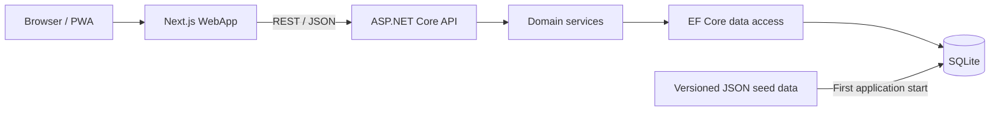

# YPS Store Finder

<p align="center">
  
</p>

YPS Store Finder is a bilingual, map-first web application for finding YPS service stores and understanding the YBS bus routes around them. The interface combines store search, GPS-based discovery, transit context, and accessible route details in one responsive experience.

## Project overview

The application is designed around the questions a commuter usually asks:

- Where is the nearest YPS store?
- Which stores match a name, category, or township search?
- Which YBS lines and stops are close to a selected store?
- What stops does a specific bus route serve?

The current UI is a soft-pastel transit console with:

- A Leaflet map with light and dark CARTO basemaps
- Store markers, GPS proximity search, category filters, and pagination
- YBS line search, YPS-supported bus filtering, and route details
- English and Myanmar language switching
- System, light, and dark themes with saved preferences
- Desktop navigation rail and a keyboard-operable mobile explorer sheet
- PWA assets, responsive layouts, reduced-motion support, visible focus states, and zoom-friendly content

### Main routes

| Route | Purpose |
| --- | --- |
| `/` or `/?view=map` | Map-first store explorer |
| `/?view=stores` | Expanded store results explorer |
| `/stores/[id]` | Store details and nearby transit context |
| `/buses` | YBS bus explorer |
| `/buses/[busNumber]` | Bus route and stop details |

## Architecture



| Project | Responsibility |
| --- | --- |
| `YpsStoreFinder.WebApp` | Next.js UI, Leaflet map, theme/language state, API client, and PWA assets |
| `YpsStoreFinder.Api` | REST controllers, OpenAPI documentation, CORS, caching, and rate limiting |
| `YpsStoreFinder.Domain` | Store and bus use cases, filtering, pagination, and DTO mapping |
| `YpsStoreFinder.Database` | EF Core context, SQLite models, relationships, and JSON data seeding |
| `YpsStoreFinder.Shared` | Shared result and pagination contracts |

### Technology stack

- **Web:** Next.js 16, React 19, TypeScript, Tailwind CSS, TanStack Query, Leaflet, Lucide
- **API:** ASP.NET Core 10 controllers, Swagger/OpenAPI, Scalar API reference
- **Data:** Entity Framework Core 10 with SQLite and versioned JSON seed files
- **Design:** Responsive light/dark themes, English/Myanmar localization, WCAG-oriented interaction patterns

## Local development

### Prerequisites

- [.NET SDK 10](https://dotnet.microsoft.com/download/dotnet/10.0)
- [Node.js 20.9 or later](https://nodejs.org/)
- npm

### 1. Start the API

From the repository root:

```powershell
dotnet restore YpsStoreFinder.slnx
dotnet run --project YpsStoreFinder.Api --launch-profile http
```

The API starts at `http://localhost:5257`. On the first run it creates `yps_finder.db` and imports the JSON files from `YpsStoreFinder.Database/Data`. Existing tables with data are not reseeded.

Development API documentation is available at:

- Swagger UI: `http://localhost:5257/swagger`
- Scalar: `http://localhost:5257/scalar/v1`
- OpenAPI JSON: `http://localhost:5257/swagger/v1/swagger.json`

### 2. Start the web application

In a second terminal:

```powershell
cd YpsStoreFinder.WebApp
npm ci
npm run dev
```

Open `http://localhost:3000`.

The web application uses `http://localhost:5257` by default. To use another API host, add `YpsStoreFinder.WebApp/.env.local`:

```dotenv
NEXT_PUBLIC_API_URL=http://localhost:5257
```

Restart the Next.js development server after changing environment variables.

## Application workflow

### Startup and data flow

1. The API registers the database and domain services.
2. Entity Framework creates the SQLite schema when it does not exist.
3. The seeder imports townships, stores, bus lines, stops, route stops, and store-to-transit relationships from JSON.
4. The web application calls the API through `YpsStoreFinder.WebApp/services/api.ts`.
5. TanStack Query coordinates request state while the synchronized map and result panels render the response.

### Store discovery flow

1. The initial store endpoint supplies markers for the map.
2. Search text and category filters request paginated results.
3. With permission, browser geolocation sends latitude, longitude, and radius filters to the nearby-store endpoint.
4. Selecting a marker or list item opens a preview; the detail action deep-links to the store page.
5. The store detail page loads nearby bus stops and serving lines without changing the backend contract.

### Bus discovery flow

1. The bus explorer loads available YBS lines.
2. Keyword and YPS-support filters use paginated API endpoints.
3. Selecting a bus number opens a deep-linked route page with its ordered stop list.

## API surface

All endpoints use the `/api` prefix. Store and bus controllers are protected by a fixed-window limit of 60 requests per minute per client IP, with a queue of 5 requests.

| Method | Endpoint | Purpose |
| --- | --- | --- |
| `GET` | `/api/stores` | Get all stores for initial rendering |
| `GET` | `/api/stores/search` | Search and paginate stores |
| `GET` | `/api/stores/categories` | Get store category totals |
| `GET` | `/api/stores/nearby` | Find stores by coordinates and radius |
| `GET` | `/api/stores/{id}` | Get one store |
| `GET` | `/api/buses` | Get all bus lines |
| `GET` | `/api/buses/yps-supported` | Get paginated YPS-supported bus lines |
| `GET` | `/api/buses/search` | Search and paginate bus lines |
| `GET` | `/api/buses/{busNumber}` | Get a route and its stops |
| `GET` | `/api/buses/nearby-store/{storeId}` | Get transit options near a store |

See [endpoints.md](endpoints.md) for the request parameters and example responses.

## Development workflow

Keep changes inside the layer that owns the behavior, and update adjacent contracts together:

1. **API or data change:** update database models/seed data, then domain DTOs and services, and finally the controller contract.
2. **Web feature change:** update TypeScript types and the API client before changing queries and UI components.
3. **Localized UI change:** update both English and Myanmar labels, including visible text, errors, ARIA labels, and live announcements.
4. **Map or theme change:** verify light/dark tiles, markers, popups, selection state, and reduced-motion behavior.
5. **Before committing:** run the backend build and the web quality gates below.

```powershell
dotnet build YpsStoreFinder.slnx

cd YpsStoreFinder.WebApp
npm run lint
npm run build
```

There is currently no automated test project in the solution, so linting, production builds, API checks, and focused browser verification are the active quality gates.

For UI work, verify at minimum:

- Light and dark themes in English and Myanmar
- Keyboard navigation, focus visibility, dialogs, and the mobile sheet
- Browser zoom/reflow, touch targets, and reduced motion
- GPS allowed, denied, loading, and error states
- Store and bus deep links plus browser back/forward navigation

### Git convention

Create focused commits using [Conventional Commits](https://www.conventionalcommits.org/):

```text
feat(web): add store category filter
fix(api): handle missing bus route
docs: clarify local development workflow
```

Do not commit generated build output, local databases, environment files, or secrets.

## Docker

The root `Dockerfile` builds the ASP.NET Core API:

```powershell
docker build -t yps-store-finder-api .
docker run --rm -p 8080:8080 yps-store-finder-api
```

The container listens on `http://localhost:8080`. The Next.js web application is developed and deployed separately; point `NEXT_PUBLIC_API_URL` at the reachable API URL for that environment.

## Additional documentation

- [DESIGN.md](DESIGN.md) — visual system and interaction direction
- [endpoints.md](endpoints.md) — API request and response reference
- [user_stories.md](user_stories.md) — product requirements and acceptance criteria
